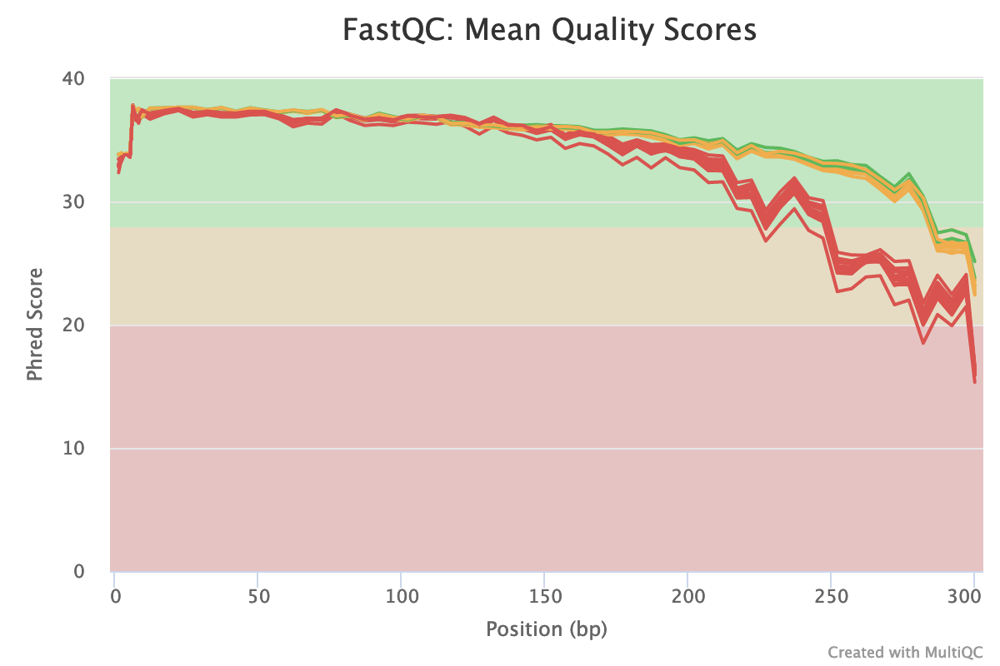

# Setup and QC

## Install QIIME and acitvate conda environment

This anlaysis was coducted using QIIME 2020.2. First step, download the yml file and then use it to create a conda environment for the install. 

```{bash}
$ wget https://data.qiime2.org/distro/core/qiime2-2020.2-py36-linux-conda.yml
$ conda env create -n qiime2-2020.2 --file qiime2-2020.2-py36-linux-conda.yml
```

Then activate the conda environment  

```{bash}
$ conda activate qiime2-2020.2
```

## Quality Check (FastQC)

Run fastqc. Note that these are gzipped fastqc files, but fastqc still works.

```{bash}
$ fastqc data-raw/*.fastq.gz
```

Running fastqc generates a fastqc.zip file and fastqc.html per fastq file. Move the fastqc generated files into a `results/fastqc` folder.

```{bash}
$ mkdir results/
$ mkdir results/fastqc
$ mv data-raw/*fastqc* results/fastqc/
```

It's also handy to run mutliQC as this allows to look at quality of all samples at once (rather than one at a time with fastQC reports)

First up, install multiQC (if not already installed)

```{bash}
$ conda install -c bioconda -c conda-forge multiqc
```

Then run multiqc on the `results/fastqc` folder.

```{bash}
$ mkdir results/multiqc
$ multiqc results/fastqc/* -o results/multiqc/
```

Note: FastQC generates fastqc reports for individual files, the benefit of using mutliqc is that we get a report where we can see all the samples at once. Benefit here is if there's one real stinker you'll be able to see it which you might miss if looking at individual fastqc reports. In the plot below the red are all the reverse reads, the quality of the reverse reads tends to always drop off sooner than the forward reads.



Based on the multiQC report: will choose limits of F 260 bp and R : 215 bp
